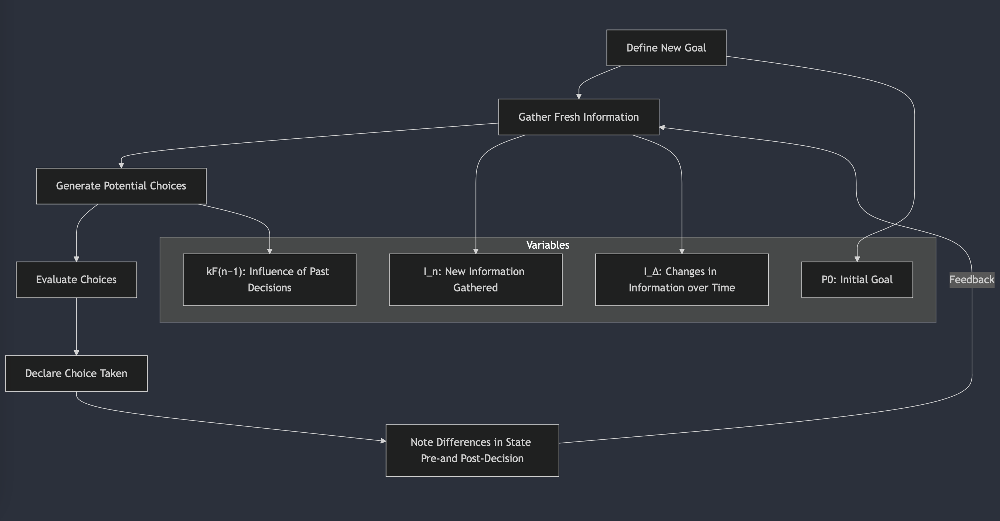

# Dynamic Decision-Making Model




A dynamic decision-making model that incorporates various factors influencing choice and goal attainment over time:

Fₙ = P₀ * kFₙ₋₁ + m(T(f(Iₙ, IΔ)) + R(Dₙ, FMₙ))


Where:

- `Fₙ` = Choice Taken
- `P₀` = Initial Goal
- `kFₙ₋₁` = Effect of the previous moment on the Declared Goal
- `m` = A rate vector (time, etc.)
- `Iₙ` = The original factual information
- `IΔ` = Facts acquired throughout the process
- `Dₙ` = A potential choice (vector of choices)
- `FMₙ` = Subjective and Objective assessments performed on `Dₙ`, considering `P₀ * kFₙ₋₁`, `Iₙ`, `IΔ`, `𝑇(𝑓(𝐼_𝑛,𝐼_Δ ))`
- `R(Dₙ, FMₙ)` = Information Gained from choosing process, where `IΔ` + `T(f(IΔ))`


___

## How it Works

**Dynamic Decision-Making Model Equation:**

```
Fₙ = P₀ * kFₙ₋₁ + m(T(f(Iₙ, IΔ)) + R(Dₙ, FMₙ))
```

**Explanation:**

The equation represents a recursive decision-making process that takes into account various factors over time:

**1. Initial Goal (P₀):**
- Represents the desired outcome the individual wishes to achieve.


**2. Previous Moment Effect (kFₙ₋₁):**
- Accounts for the influence of the previous decision on the current goal.
- kFₙ₋₁ indicates how much the previous decision outcome affects the current goal setting.


**3. Rate Vector (m):**
- Represents the rate at which factors such as time, motivation, and attention influence the decision-making process.


**4. Factual Information (Iₙ and IΔ):**
- Iₙ represents the initial factual information available.
- IΔ reflects newly acquired facts throughout the process.


**5. Choice Potential (Dₙ):**
- Represents the potential choices available at the current decision point.


**6. Subjective and Objective Assessments (FMₙ):**
- Considers both subjective assessments (personal beliefs, values) and objective assessments (factual information, feedback) to evaluate each potential choice.


**7. Information Gain (R(Dₙ, FMₙ)):**
- Represents the amount of information gained from the decision-making process.
- This includes both the new factual information acquired and the insights gained from the evaluation process.


**The equation works as follows:**

- The initial goal (P₀) and previous decision effect (kFₙ₋₁) are combined to determine the updated goal.
- The rate vector (m) is used to adjust for temporal factors.
- The factual information (Iₙ and IΔ) and subjective/objective assessments (FMₙ) are considered when evaluating potential choices.
- The information gained from the decision-making process (R(Dₙ, FMₙ)) is added to update the goal.


**Overall, this dynamic decision-making model takes into account the evolving nature of goals, the gradual acquisition of information, and the influence of previous decisions on future choices.**