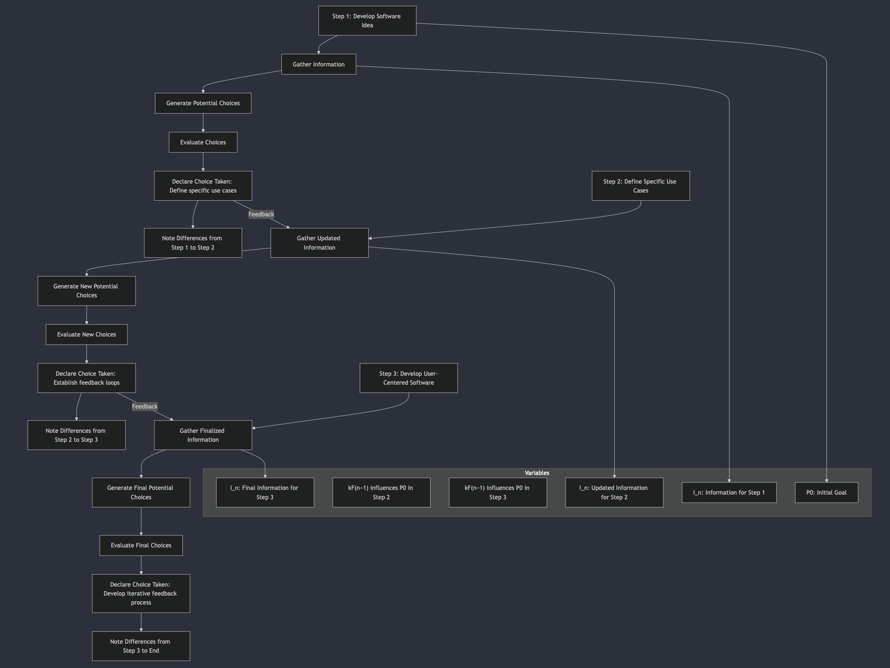
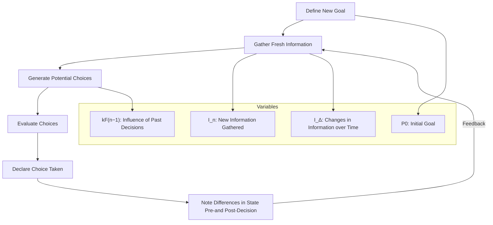
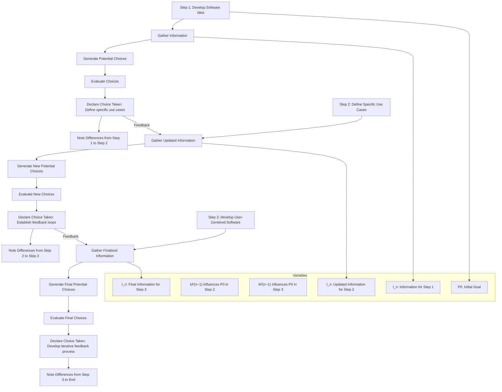

____
# Original Goal
Develop a piece of software for which I already have a mental idea and a stack plan 

# Information

Information: I'm planning on using Postgres to store/read the data 

I'm planning on using openAI API but via an agent workflow. I can set up my pre programmed agents with Flowise, then each one gets it own dedicated endpoint 

I usually write up my programs in R, stitching it all together

Theory behind the plan: 
A dynamic decision-making model that incorporates various factors influencing choice and goal attainment over time

- 𝐹_𝑛= 𝑃_0∗𝑘𝐹_(𝑛−1)+𝑚(𝑇(𝑓(𝐼_𝑛,𝐼_Δ ))+𝑅(𝐷_𝑛,〖𝐹𝑀〗_𝑛 ))
- 𝐹_𝑛 = Choice Taken
- 𝑃_0 = Initial Goal
- 𝑘𝐹_(𝑛−1) = effect of previous moment on the Declared Goal
- 𝑚 = a rate vector (time, etc.)
- 𝐼_𝑛 = the original factual information
- 𝐼_Δ = facts acquired throughout the process
- 𝐷_𝑛 = a potential choice (vector of choices)
- 〖𝐹𝑀〗_𝑛 = Subjective and Objective assessments performed on 𝐷_𝑛 , considering 𝑃_0∗𝑘𝐹_(𝑛−1), 𝐼_𝑛 , 𝐼_Δ , 𝑇(𝑓(𝐼_𝑛,𝐼_Δ ))
- 𝑅(𝐷_𝑛,〖𝐹𝑀〗_𝑛 ) = 𝐼_Δ  + 𝑇(𝑓(𝐼_Δ )) = Information Gained from choosing process

## Semantic Interpretation of Goal and Information

- software development
- mental model
- stack plan
- Postgres
- data storage
- OpenAI API
- agent workflow
- pre programmed agents
- Flowise
- dedicated endpoint
- R programming
- dynamic decision-making model
- choice
- goal attainment
- initial goal
- previous moment effect
- rate vector
- factual information
- acquired facts
- potential choices
- subjective assessments
- objective assessments
- information gained

## Generating Multiple Choices To Take

### Potential Choices

- Define specific use cases for dynamic decision-making
- Set up a Postgres database schema for data storage
- Integrate OpenAI API with Flowise for agent workflows
- Design pre programmed agents for different decision-making factors
- Develop R scripts to stitch together data inputs and outputs
- Create endpoints for each agent to handle requests
- Implement a method for tracking previous moment effects
- Establish a process for real-time data acquisition and updates
- Perform subjective and objective assessments on potential choices
- Test and validate the dynamic decision-making model
- Document the software architecture and agent workflows
- Plan iterative development phases and user feedback loops
- Explore visualization options for decision-making processes
- Ensure compliance with data handling regulations
- Prepare for deployment and scaling considerations

# Evaluation of Potential Choices 

| Potential Choice                                      | Subjective Assessment                                                                                   | Objective Assessment                                                               |
|------------------------------------------------------|--------------------------------------------------------------------------------------------------------|------------------------------------------------------------------------------------|
| Define specific use cases for dynamic decision-making | High importance—provides direction and clarity for the software's purpose and target audience.         | Sets a functional baseline for the scope of the project, ensuring it meets user needs. |
| Set up a Postgres database schema for data storage   | Critical—effective data storage and retrieval is fundamental for performance and decision accuracy.   | Establishes the foundation for data management necessary for the application.      |
| Integrate OpenAI API with Flowise for agent workflows | Highly beneficial—leverages advanced AI capabilities for enhancing decision-making processes.          | Execution will determine integration success and functionality of AI capabilities.  |
| Design pre programmed agents for different decision-making factors | Essential—customizing agents will tailor the approach to specific scenarios and decisions.            | Provides modularity and flexibility within the software structure.                 |
| Develop R scripts to stitch together data inputs and outputs | Navigating workflows—important for automation of decision processes while using familiar programming. | Necessary for functionality, linking data seamlessly to decision outcomes.         |
| Create endpoints for each agent to handle requests    | Important for performance—dedicated endpoints ensure efficient API interactions.                       | Facilitates scalability and modular access to functionality per agent.             |
| Implement a method for tracking previous moment effects| Valuable for model accuracy—enhances the understanding of how past decisions impact future outcomes.  | Important for the integrity of the dynamic model and its predictive capabilities.   |
| Establish a process for real-time data acquisition and updates | Crucial for adaptability—ensures decisions are made based on the most current data.                  | Provides competitively advantageous responsiveness in decision-making.             |
| Perform subjective and objective assessments on potential choices | Important for reflective practice—ensures an understanding of decision pathways and biases.          | Systematic evaluation will guide improvements and refinements in the choice model.  |
| Test and validate the dynamic decision-making model   | Necessary for confidence—ensures the model works as intended and offers valid insights to users.     | Critical phase for verifying functionality and solidifying user trust.            |
| Document the software architecture and agent workflows| Enhances clarity—important for future development and onboarding new team members or users.           | Serves as a reference guide and can improve maintainability and collaboration.     |
| Plan iterative development phases and user feedback loops | Key for user-centered design—facilitates continuous improvement based on real user input.            | Promotes agile methodologies, ensuring responsiveness to changing requirements.    |
| Explore visualization options for decision-making processes| Valuable for user engagement—effective visualizations improve usability and understanding of choices.  | Enhances the software's accessibility, facilitating better decision-making for users. |
| Ensure compliance with data handling regulations      | Critical for ethical standards and legality—protects both the developer and the user.                 | Helps mitigate legal risks and enhances user trust in the application’s integrity.  |
| Prepare for deployment and scaling considerations     | Strategic overview needed—ensuring readiness for growth in users or data is essential for longevity.  | Important for practical implementation and future-proofing the software solution.   |

# Choice Taken

**Define specific use cases for dynamic decision-making.**

# Creating a Difference Vector Post-Choice

- Before choosing: The initial state involved a broad range of potential choices which encompassed the entire development process of the software, from setting up a Postgres database schema to ensuring compliance with data regulations. Each choice had its own subjective and objective assessments accounting for importance, impact, and strategic relevance. There was a focus on methodologies, integrations, and the development workflow thoroughly analyzing how different aspects contribute to the primary goal of building the software. 
- After choosing: The decision to define specific use cases for dynamic decision-making refines the focus of the project, establishing a direction and clarity for purpose and target audience. This choice provides a functional baseline for the software, ensuring that subsequent efforts align with user needs, enhancing the applicability and relevance of all integrated components in the development pipeline, while simplifying further assessments of remaining choices in the context of user-centric requirements.'

# Semantic Interpretation of Difference Vector

- initial state
- potential choices
- development process
- Postgres database schema
- data regulations
- subjective assessments
- objective assessments
- importance
- impact
- strategic relevance
- methodologies
- integrations
- development workflow
- aspects
- primary goal
- building software
- specific use cases
- dynamic decision-making
- project focus
- direction
- clarity
- purpose
- target audience
- functional baseline
- user needs
- applicability
- relevance
- integrated components
- development pipeline
- user-centric requirements

# New Goal Declaration
Develop targeted dynamic decision-making software based on defined use cases utilizing Postgres, OpenAI API, and agent workflows.

# New Full Information Vector

-  Goal: Develop targeted dynamic decision-making software based on defined use cases utilizing Postgres, OpenAI API, and agent workflows.

-  Information: I'm planning on using Postgres to store/read the data 

    I'm planning on using openAI API but via an agent workflow. I can set up my pre programmed agents with Flowise, then each one gets it own dedicated endpoint 

    I usually write up my programs in R, stitching it all together

    Theory behind the plan: 
    A dynamic decision-making model that incorporates various factors influencing choice and goal attainment over time

    - 𝐹_𝑛= 𝑃_0∗𝑘𝐹_(𝑛−1)+𝑚(𝑇(𝑓(𝐼_𝑛,𝐼_Δ ))+𝑅(𝐷_𝑛,〖𝐹𝑀〗_𝑛 ))
    - 𝐹_𝑛 = Choice Taken
    - 𝑃_0 = Initial Goal
    - 𝑘𝐹_(𝑛−1) = effect of previous moment on the Declared Goal
    - 𝑚 = a rate vector (time, etc.)
    - 𝐼_𝑛 = the original factual information
    - 𝐼_Δ = facts acquired throughout the process
    - 𝐷_𝑛 = a potential choice (vector of choices)
    - 〖𝐹𝑀〗_𝑛 = Subjective and Objective assessments performed on 𝐷_𝑛 , considering 𝑃_0∗𝑘𝐹_(𝑛−1), 𝐼_𝑛 , 𝐼_Δ , 𝑇(𝑓(𝐼_𝑛,𝐼_Δ ))
    - 𝑅(𝐷_𝑛,〖𝐹𝑀〗_𝑛 ) = 𝐼_Δ  + 𝑇(𝑓(𝐼_Δ )) = Information Gained from choosing process

- Choice Taken In Past: Define specific use cases for dynamic decision-making.

- Difference Vector From Choice: 
    - Before choosing: The initial state involved a broad range of potential choices which encompassed the entire development process of the software, from setting up a Postgres database schema to ensuring compliance with data regulations. Each choice had its own subjective and objective assessments accounting for importance, impact, and strategic relevance. There was a focus on methodologies, integrations, and the development workflow thoroughly analyzing how different aspects contribute to the primary goal of building the software. 
    - After choosing: The decision to define specific use cases for dynamic decision-making refines the focus of the project, establishing a direction and clarity for purpose and target audience. This choice provides a functional baseline for the software, ensuring that subsequent efforts align with user needs, enhancing the applicability and relevance of all integrated components in the development pipeline, while simplifying further assessments of remaining choices in the context of user-centric requirements.'

# Semantic Translation of Information Vector 

- dynamic decision-making
- software development
- Postgres
- OpenAI API
- agent workflows
- Flowise
- R programming
- goal attainment
- decision-making model
- initial goal
- effect of previous moment
- rate vector
- factual information
- acquired facts
- potential choices
- subjective assessments
- objective assessments
- information gained
- use cases
- data regulations
- methodologies
- integrations
- workflow analysis
- user needs
- functional baseline
- project focus
- target audience
- development pipeline
- user-centric requirements

# Choices Presented

- Identify key metrics for assessing decision quality
- Design user interface prototypes for agent workflows
- Develop data validation strategies for Postgres
- Create test cases for dynamic decision-making scenarios
- Establish feedback loops to incorporate user input on decision outcomes
- Explore integration options with other APIs for data enrichment
- Implement machine learning algorithms for enhanced decision support
- Conduct user interviews to refine software requirements
- Document best practices for using OpenAI API with agent workflows
- Plan a phased deployment strategy for iterative development

# Evaluation of Choices 

### Evaluation Table

| Choice                                                                 | Subjective Assessment                                                                                       | Objective Assessment                                                                                             |
|------------------------------------------------------------------------|-------------------------------------------------------------------------------------------------------------|-----------------------------------------------------------------------------------------------------------------|
| Identify key metrics for assessing decision quality                    | Essential for measuring success, increases accountability and clarity on performance.                       | Metrics can be quantitatively defined and used to assess decision quality; establishes baseline KPIs.            |
| Design user interface prototypes for agent workflows                   | Critical for ensuring usability and aligning with user needs; enhances user experience.                     | Prototypes facilitate user testing and feedback; streamline development phase by clarifying UI requirements.     |
| Develop data validation strategies for Postgres                        | Important for maintaining data integrity and reliability; subjective importance based on data sensitivity.   | Formal validation protocols can be established to ensure data quality; necessary for compliance with regulations. |
| Create test cases for dynamic decision-making scenarios                 | Adds confidence in system reliability; subjective importance tied to risk management.                       | Test cases provide a systematic approach to verify software functionality and catch errors before deployment.    |
| Establish feedback loops to incorporate user input on decision outcomes | Promotes user engagement and satisfaction; subjective feeling of improving software relevance and utility.  | Creates a systematic method for continuous improvement; important for agile methodologies and iterative feedback. |
| Explore integration options with other APIs for data enrichment        | Potentially enriches the decision-making model; subjective preference for extensive data sources.           | Can quantitatively increase the robustness of the system; facilitates comparative analysis from diverse datasets.  |
| Implement machine learning algorithms for enhanced decision support     | Exciting avenue for advancement; subjective appeal for incorporating modern technology in solutions.       | Machine learning can improve decision accuracy and efficiency; measurable improvements in predictive performance.  |
| Conduct user interviews to refine software requirements                | Directly aligns development with user needs; subjective significance on feature relevance and priority.      | Structured interviews can yield actionable insights; a methodical approach helps to gather and analyze data effectively. |
| Document best practices for using OpenAI API with agent workflows      | Enhances team knowledge and reduces learning curve; boosts confidence in API integration.                    | Provides a reference that can improve efficiency and consistency; supports onboard new team members.              |
| Plan a phased deployment strategy for iterative development             | Supports adaptive learning and flexibility throughout the development process; subjective alignment with modern practices. | Establish clear milestones for tracking progress; aligns project with Agile methodologies, promoting efficiency in deployments. |

# Choice Taken

**Establish feedback loops to incorporate user input on decision outcomes.**

# Difference Vector 

- Before choosing: The initial state involved a broad range of potential choices which encompassed the entire development process of the software, from setting up a Postgres database schema to ensuring compliance with data regulations. Each choice had its own subjective and objective assessments accounting for importance, impact, and strategic relevance. There was a focus on methodologies, integrations, and the development workflow, thoroughly analyzing how different aspects contribute to the primary goal of building the software. 

- After choosing: The decision to establish feedback loops to incorporate user input on decision outcomes refines the focus of the project, enhancing user engagement and satisfaction, thereby improving the software’s relevance and utility. This choice aids in creating a systematic method for continuous improvement, aligning iterations with user needs and expectations, while simplifying further assessments of other choices within a user-centric framework.

# Semantic Interpretation of Difference Vector 

- Initial State
- Potential Choices
- Development Process
- Postgres Database Schema
- Data Regulations Compliance
- Subjective Assessments
- Objective Assessments
- Importance
- Impact
- Strategic Relevance
- Methodologies
- Integrations
- Development Workflow
- Analyzing Contributions
- Primary Goal
- Feedback Loops
- User Input
- Decision Outcomes
- User Engagement
- User Satisfaction
- Software Relevance
- Utility
- Systematic Method
- Continuous Improvement
- Iterations
- User Needs
- User Expectations
- User-Centric Framework
- Assessment Simplification

# New Goal Declared 

Develop user-centered dynamic decision-making software based on well-defined use cases, leveraging Postgres, OpenAI API, and agent workflows, while incorporating iterative feedback for continuous improvement.

# New Full Information Vector 

-  Goal: Develop user-centered dynamic decision-making software based on well-defined use cases, leveraging Postgres, OpenAI API, and agent workflows, while incorporating iterative feedback for continuous improvement.

-  Information: I'm planning on using Postgres to store/read the data 

    I'm planning on using openAI API but via an agent workflow. I can set up my pre programmed agents with Flowise, then each one gets it own dedicated endpoint 

    I usually write up my programs in R, stitching it all together

    Theory behind the plan: 
    A dynamic decision-making model that incorporates various factors influencing choice and goal attainment over time

    - 𝐹_𝑛= 𝑃_0∗𝑘𝐹_(𝑛−1)+𝑚(𝑇(𝑓(𝐼_𝑛,𝐼_Δ ))+𝑅(𝐷_𝑛,〖𝐹𝑀〗_𝑛 ))
    - 𝐹_𝑛 = Choice Taken
    - 𝑃_0 = Initial Goal
    - 𝑘𝐹_(𝑛−1) = effect of previous moment on the Declared Goal
    - 𝑚 = a rate vector (time, etc.)
    - 𝐼_𝑛 = the original factual information
    - 𝐼_Δ = facts acquired throughout the process
    - 𝐷_𝑛 = a potential choice (vector of choices)
    - 〖𝐹𝑀〗_𝑛 = Subjective and Objective assessments performed on 𝐷_𝑛 , considering 𝑃_0∗𝑘𝐹_(𝑛−1), 𝐼_𝑛 , 𝐼_Δ , 𝑇(𝑓(𝐼_𝑛,𝐼_Δ ))
    - 𝑅(𝐷_𝑛,〖𝐹𝑀〗_𝑛 ) = 𝐼_Δ  + 𝑇(𝑓(𝐼_Δ )) = Information Gained from choosing process

- Choice Taken In Past: Define specific use cases for dynamic decision-making.

- Difference Vector From Choice: 
    - Before choosing: The initial state involved a broad range of potential choices which encompassed the entire development process of the software, from setting up a Postgres database schema to ensuring compliance with data regulations. Each choice had its own subjective and objective assessments accounting for importance, impact, and strategic relevance. There was a focus on methodologies, integrations, and the development workflow thoroughly analyzing how different aspects contribute to the primary goal of building the software. 
    - After choosing: The decision to define specific use cases for dynamic decision-making refines the focus of the project, establishing a direction and clarity for purpose and target audience. This choice provides a functional baseline for the software, ensuring that subsequent efforts align with user needs, enhancing the applicability and relevance of all integrated components in the development pipeline, while simplifying further assessments of remaining choices in the context of user-centric requirements.'

- Second Choice Taken:  Establish feedback loops to incorporate user input on decision outcomes.

- Difference Vector From Second Choice: 

    - Before choosing: The initial state involved a broad range of potential choices which encompassed the entire development process of the software, from setting up a Postgres database schema to ensuring compliance with data regulations. Each choice had its own subjective and objective assessments accounting for importance, impact, and strategic relevance. There was a focus on methodologies, integrations, and the development workflow, thoroughly analyzing how different aspects contribute to the primary goal of building the software. 

    - After choosing: The decision to establish feedback loops to incorporate user input on decision outcomes refines the focus of the project, enhancing user engagement and satisfaction, thereby improving the software’s relevance and utility. This choice aids in creating a systematic method for continuous improvement, aligning iterations with user needs and expectations, while simplifying further assessments of other choices within a user-centric framework.

___

# Mermaid Diagrams 

*Note that they may be cutoff depending on your screen size in the Github Renderer

